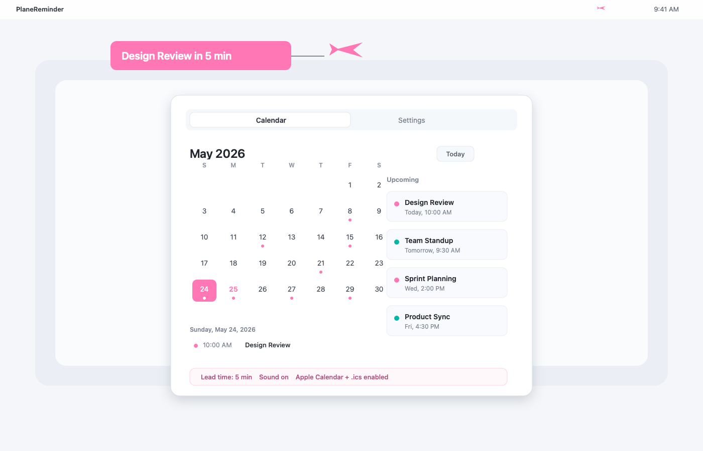
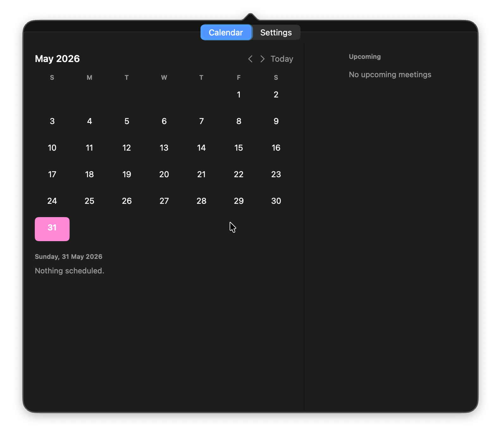
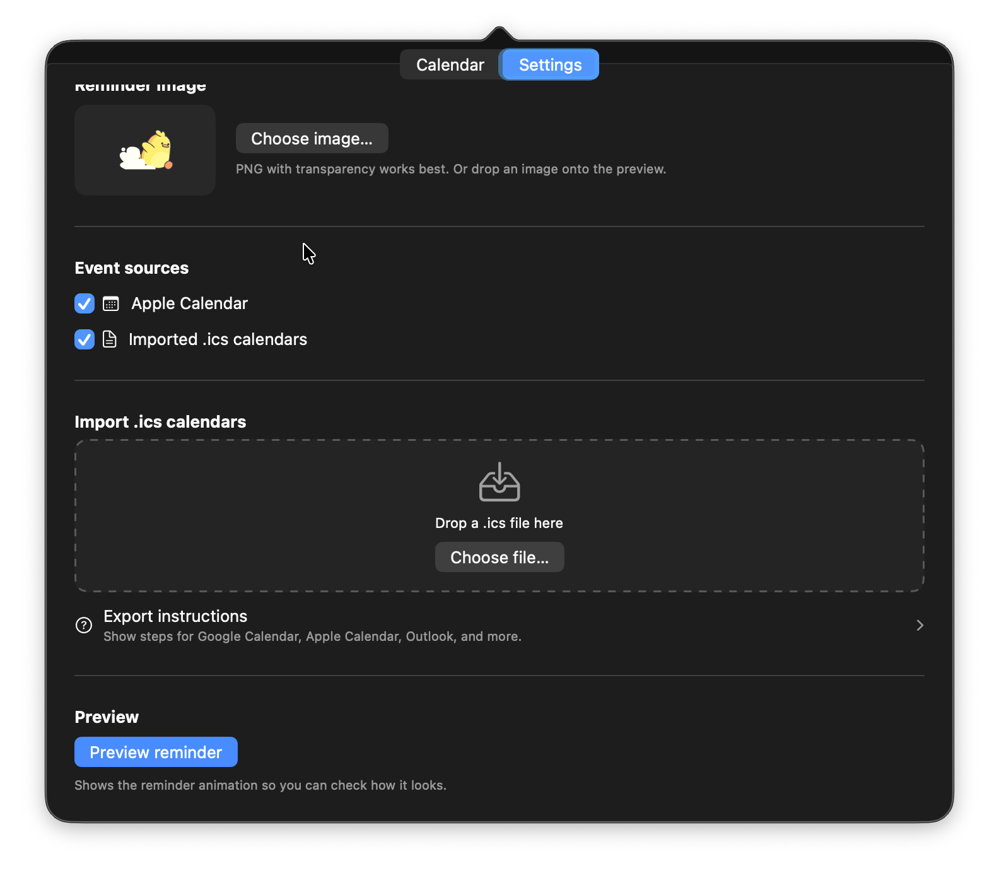

# OnCue

OnCue is a tiny local-only macOS menu-bar app that turns calendar reminders into a playful screen flyby.

A small runner crosses your display with the meeting name before your next event, even over full-screen calls. No accounts, no OAuth, no telemetry.

Inspired by [@conniecodes](https://www.instagram.com/conniecodes/).



Demo recording: [watch the reminder animation](docs/demo.mp4).

## Screenshots

| Calendar | Settings |
| --- | --- |
|  |  |

## Features

- 🐥 **Animated reminders** — A tiny runner with a banner crosses your main display N minutes before each meeting.
- 🪟 **Works above full-screen apps** — Overlay window sits above full-screen Zoom, Google Meet, etc.
- 📅 **Apple Calendar (EventKit)** — Reads any account you've added in System Settings → Internet Accounts (Google, iCloud, Office 365 included).
- 📂 **`.ics` import** — Drop in `.ics` files exported from Google Calendar, Outlook, Fastmail, Fantastical, or anywhere else. No accounts, no OAuth.
- 🎨 **Custom reminder image** — Drop in any PNG.
- ⚙️ **Per-calendar toggles** — Mute calendars you don't want reminders for.
- 🕒 **Configurable reminder time** — 1–120 minutes before the meeting, with quick picks for common timings.

## Requirements

- macOS 14 Sonoma or later
- Xcode 15+ if building from source

## Install

If a GitHub Release has a DMG attached:

1. Download `OnCue.dmg`.
2. Open it.
3. Drag `OnCue.app` to Applications.
4. Open OnCue from Applications.
5. Grant calendar access on first launch.
6. Click the menu-bar icon to set reminder timing, preview the animation, or import `.ics` calendars.

The GitHub Actions release workflow can publish an unsigned DMG without an Apple Developer account. macOS may require right-click → Open on first launch. A no-warning public install requires Apple Developer ID signing and notarization.

## Build From Source

1. Clone this repo.
2. Open `OnCue.xcodeproj` in Xcode.
3. Select the `OnCue` scheme and your Mac as the destination.
4. In Signing & Capabilities, pick your team if Xcode asks. The project intentionally has no App Sandbox entitlement so EventKit and file imports work without extra configuration.
5. Build & run (⌘R).
6. Grant calendar access on first launch. Optionally drop a `.ics` file into Settings → Import .ics calendars.

CLI build/test:

```sh
xcodebuild -project OnCue.xcodeproj -scheme OnCue -destination 'platform=macOS' CODE_SIGNING_ALLOWED=NO build
xcodebuild -project OnCue.xcodeproj -scheme OnCue -destination 'platform=macOS' CODE_SIGNING_ALLOWED=NO test
```

Create a local DMG:

```sh
Scripts/package_dmg.sh
```

## Usage

- The app lives in your menu bar as a small reminder icon.
- Click the icon to open the popover.
- Adjust **Reminder timing** (default 5 min), pick a **reminder image**, manage **sources**, import **.ics** files, and hit **Preview reminder** to try it.

### Exporting `.ics` files

| Provider          | How to get a `.ics`                                                                                 |
|-------------------|-----------------------------------------------------------------------------------------------------|
| Google Calendar   | Settings → "Settings for my calendars" → pick one → **Export calendar** |
| Apple Calendar    | File → Export → Export… (or just enable the Apple source — no export needed)                        |
| Outlook (web)     | Settings → Calendar → Shared calendars → Publish → ICS link                                          |
| Outlook (Mac app) | File → Save Calendar                                                                                 |
| Fastmail          | Calendar → Settings → choose calendar → "iCal URL"                                                  |
| Fantastical       | Calendar set → Share → Download `.ics`                                                              |

Re-export and drop the same file again to refresh — `.ics` files with the same filename overwrite.

## Privacy & security

OnCue is designed as a local-only personal tool.

- No accounts, no OAuth, no API keys, and no third-party SDKs.
- No telemetry, analytics, crash reporting, or background uploads.
- No network client code. The app does not fetch `webcal://`, `http://`, or `https://` calendar URLs itself.
- Apple Calendar events are read locally through EventKit after macOS permission is granted.
- Imported `.ics` files are copied into `~/Library/Application Support/OnCue/Calendars/`.
- A custom reminder image, if chosen, is stored as `~/Library/Application Support/OnCue/reminder-image.png`.
- Settings are stored in local `UserDefaults`.

## Architecture

```
OnCueApp ─ AppDelegate
                    ├── status bar item → MainView (popover)
                    ├── EventStore ──► AppleCalendarProvider (EventKit)
                    │              └─► ICSCalendarProvider ──► ICSStore (files) + ICSParser
                    ├── MeetingMonitor (timer; fires N min before each event)
                    └── OverlayWindow → ReminderOverlayView (NSWindow above full-screen)
```

- All providers conform to `EventProvider`. `EventStore.refreshAll()` aggregates enabled sources and filters them through source/calendar settings.
- `.ics` files live in `~/Library/Application Support/OnCue/Calendars/`.
- `ICSParser` is a pure-Swift RFC 5545 subset (DTSTART/DTEND/DURATION/RRULE for DAILY/WEEKLY/MONTHLY/YEARLY with INTERVAL/COUNT/UNTIL/BYDAY).
- Unit tests cover the important parser behavior in `Tests/OnCueTests/`.

## Limitations

- macOS only.
- Main display only — multi-monitor support is on the roadmap.
- `.ics` parser does **not** support: `EXDATE`, `RDATE`, `RECURRENCE-ID`, `BYMONTHDAY`, `BYSETPOS`, `BYDAY` ordinal prefixes (e.g. "1MO" treated as plain MO).
- All-day events are skipped (no reminder for a multi-day event).
- `.ics` files are imported as a snapshot — re-drop the file to refresh.

## License

MIT — see [`LICENSE`](LICENSE).

## Credit

Concept by [@conniecodes](https://www.instagram.com/conniecodes/).
